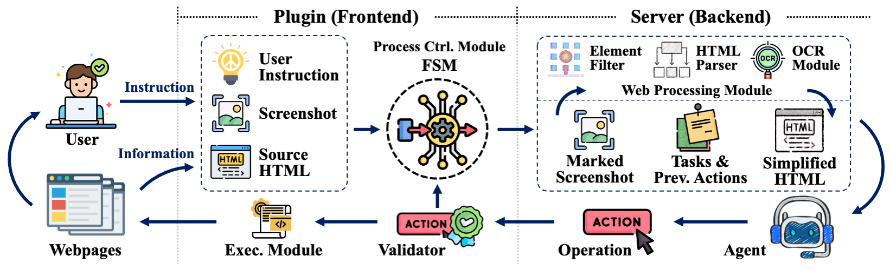

# OpenWebAgent: An Open Toolkit to Enable Web Agents on Large Language Models

## Overview

OpenWebAgent is an open toolkit that enables model-based web agents to streamline human-computer interactions by automating tasks on webpages. We provide the plugin and server source code so that users can easily add their own models to the backend to get a usable web browsing agent.

## Features

- **High-Performance HTML Parser**: This parser is designed for optimal performance. It simplifies complex HTML into a more straightforward format, allowing OpenWebAgent to process web documents with greater accuracy and speed than ever before.
- **Unique Interaction Workflow Design**: Our plugin integrates user intent, previous action history, and parsed HTML content for LLMs to create a coherent plan of action that aligns with the user's intent. Also, the modular design of our workflow allows for easy model integration and allows other developers to easily replace modules in the toolkit.
- **Streamlined and Attractive User Interface**: Our plugin requires no complex environment setup and is ready to use immediately after download. User can easily track the current process and sequence of operations, and control the task execution process with a few simple buttons.

## Usage

Please refer to the `README.md` in the corresponding directory.